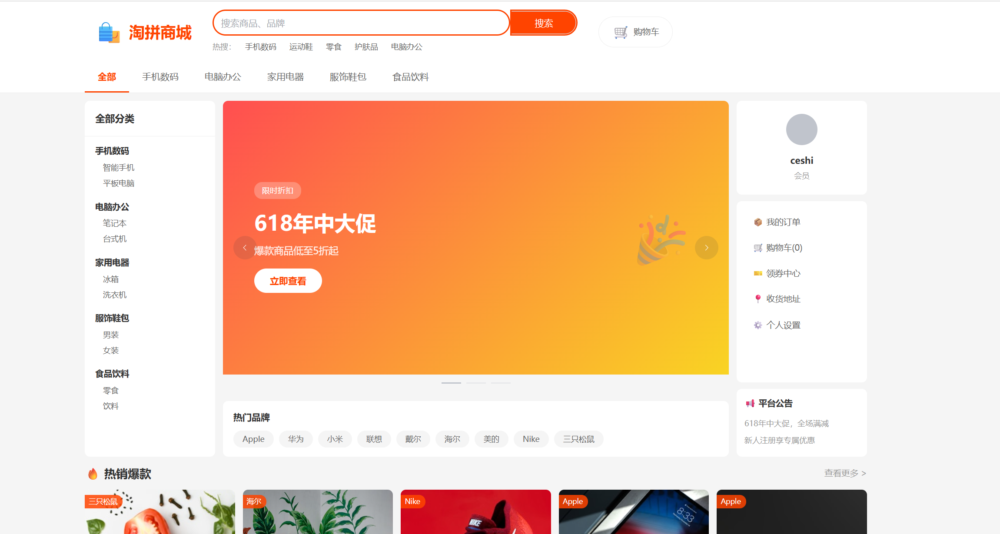
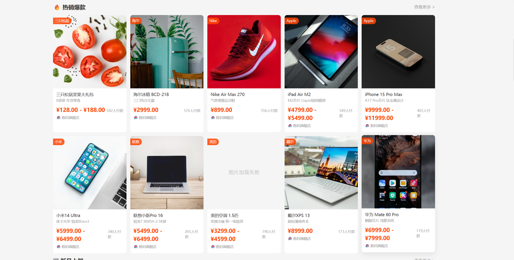
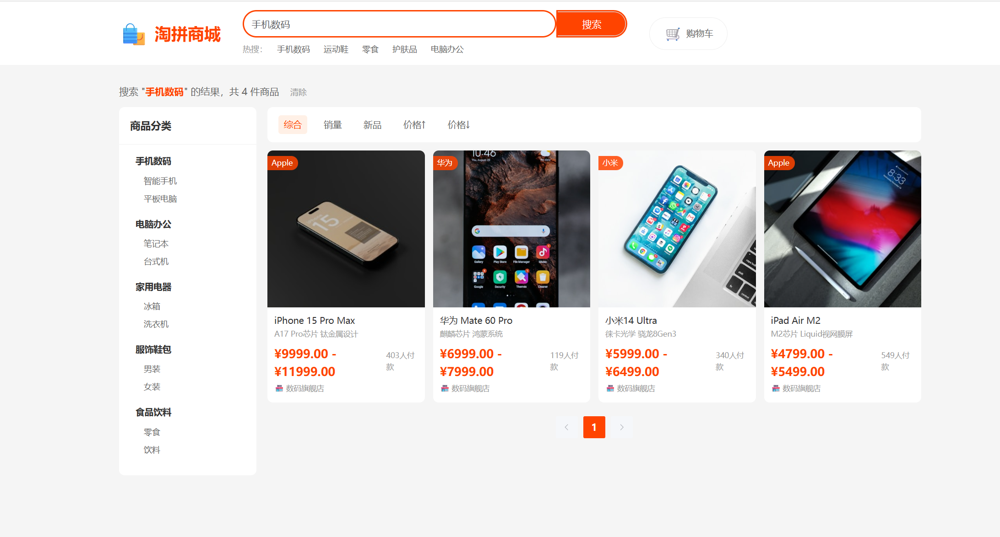
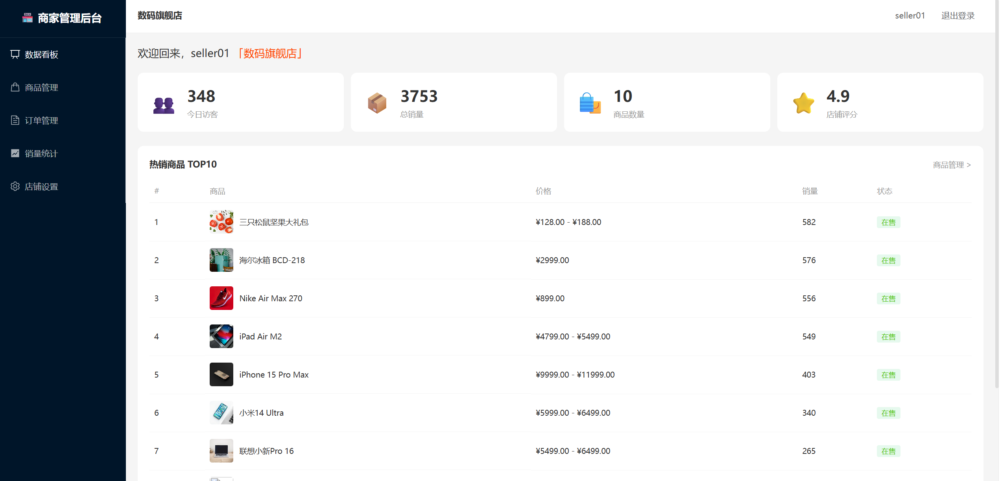
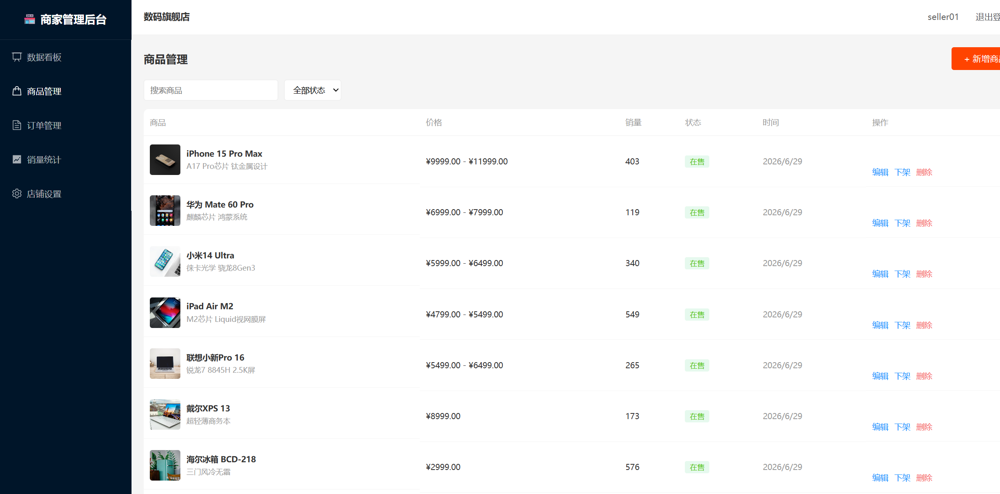
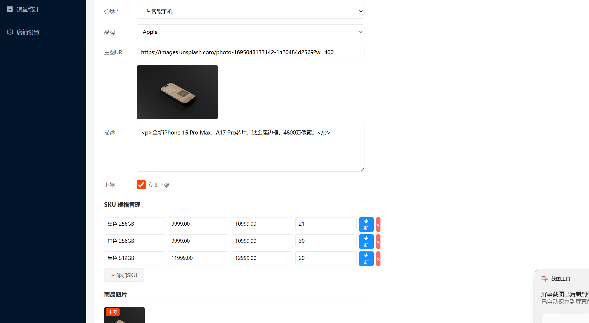

# 🛒 淘拼商城 — 全栈电商平台

> 基于 Django REST Framework + Vue 3 的全栈电商系统，包含用户、商品、购物车、订单、支付、优惠券、评价、搜索 8 大核心模块。

## 📸 项目展示

| 首页 | 商品列表 | 商品详情 |
|:---:|:---:|:---:|
|  |  |  |

| 购物车 | 订单列表 | 优惠券中心 |
|:---:|:---:|:---:|
|  |  |  |

## 🏗️ 技术栈

| 层级 | 技术 |
|------|------|
| **后端** | Python 3.12 · Django 6.0 · Django REST Framework · Celery 5 |
| **前端** | Vue 3.5 · Vite 8 · Element Plus · Pinia · Vue Router 5 |
| **数据库** | MySQL 8.0 · Redis 5.0 |
| **认证** | JWT（SimpleJWT）· 双 Token 机制 |
| **测试** | pytest · pytest-django（51 个单元测试） |
| **部署** | Docker · docker-compose · Nginx |

## ✨ 核心功能

### 用户模块
- 用户注册/登录（支持用户名、手机号、邮箱三种方式）
- JWT 双 Token 认证（Access Token 2h + Refresh Token 7d + 自动刷新）
- 收货地址管理、升级商家、店铺设置

### 商品模块
- SPU/SKU 分离设计，支持多规格、独立库存
- 分类树（自关联外键）、品牌管理、图片上传
- 商品搜索（多字段模糊搜索）、热销排行、分类筛选
- Redis 缓存分类树和热销商品，写操作时主动失效

### 购物车
- **Redis Hash 存储**：key=`cart:{user_id}`，读写速度比 MySQL 快 100 倍
- 支持添加、删除、修改数量、全选/取消全选、清空
- 批量查询优化，`select_related` 避免 N+1 查询

### 订单模块
- **防超卖方案**：`transaction.atomic()` + `select_for_update()` 行锁
- 订单状态机：待付款 → 待发货 → 已发货 → 已完成 / 已取消 / 退款中
- 快照设计：OrderItem 用 IntegerField 存储 sku_id，商品改名改价不影响历史订单
- 软删除：`is_deleted` 标记，保留审计记录

### 支付模块
- 模拟支付流程（开发环境）
- 支付回调签名验证 + 状态值白名单
- 事务保证支付记录和订单状态一致性

### 优惠券
- 三种类型：满减券、折扣券、新人券
- **防超发**：`F()` 表达式原子扣减 + `unique_together` 唯一约束
- 下单时自动抵扣，支持选择优惠券

### 评价模块
- 1-5 星评分、图片评价、匿名评价
- 点赞防重复（`get_or_create` + 唯一约束 + `F()` 原子递增）
- 重复评价校验

### 搜索模块
- 搜索历史记录（Redis 缓存 + 数据库持久化）
- 搜索建议（从商品名称中提取）

## 🚀 快速启动

### 环境要求
- Python 3.10+ · MySQL 8.0 · Redis 5.0+ · Node.js 18+

### 后端启动

```bash
# 克隆项目
git clone https://github.com/gaopeilu/taopin.git
cd taopin

# 创建虚拟环境
python -m venv .venv
source .venv/bin/activate  # Mac/Linux
# .venv\Scripts\activate   # Windows

# 安装依赖
pip install -r requirements.txt

# 创建数据库
mysql -u root -p -e "CREATE DATABASE dianshang DEFAULT CHARACTER SET utf8mb4;"

# 迁移数据库
python manage.py migrate

# 创建管理员
python manage.py createsuperuser

# 启动后端
python manage.py runserver

# 启动 Celery（另开终端）
celery -A dianshang worker -l info
celery -A dianshang beat -l info
```

### 前端启动

```bash
cd frontend
npm install
npm run dev  # http://localhost:3001
```

### Docker 一键启动

```bash
docker-compose up -d
```

## 🧪 运行测试

```bash
pytest tests/ -v
```

```
tests/test_cart.py    ············  12 passed
tests/test_goods.py   ··········   10 passed
tests/test_orders.py  ············ 12 passed
tests/test_payment.py ·····        5 passed
tests/test_users.py   ············ 12 passed
======================= 51 passed ========================
```

## 📁 项目结构

```
taopin/
├── dianshang/              # Django 项目配置
│   ├── settings.py         # 全局配置（MySQL、Redis、Celery、JWT）
│   ├── celery.py           # Celery 应用配置
│   └── urls.py             # 路由入口
├── apps/                   # 业务模块
│   ├── users/              # 用户（注册、登录、地址、升级商家）
│   ├── goods/              # 商品（SPU/SKU、分类、品牌、图片）
│   ├── orders/             # 订单（创建、支付、发货、退款）
│   ├── cart/               # 购物车（Redis Hash）
│   ├── payment/            # 支付（创建、模拟支付、回调）
│   ├── marketing/          # 优惠券（领取、使用、过期）
│   ├── reviews/            # 评价（评分、点赞、图片）
│   └── search/             # 搜索（历史、建议）
├── utils/                  # 公共工具（响应格式、权限、异常处理）
├── tests/                  # 单元测试（51 个用例）
├── frontend/               # Vue 3 前端
├── screenshots/            # 项目截图
├── requirements.txt        # Python 依赖
├── docker-compose.yml      # Docker 编排
└── pytest.ini              # 测试配置
```

## 📊 API 接口总览

| 模块 | 接口数 | 主要接口 |
|------|--------|---------|
| 用户 | 13 | 注册、登录、个人信息、地址、升级商家 |
| 商品 | 5 ViewSet | 分类、品牌、SPU、SKU、图片 |
| 购物车 | 6 | 添加、删除、修改、清空、全选 |
| 订单 | 8 | 创建、支付、发货、收货、取消、退款 |
| 支付 | 4 | 创建支付、模拟支付、状态查询、回调 |
| 优惠券 | 3 | 列表、领取、我的优惠券 |
| 评价 | 4 | 列表、创建、我的评价、点赞 |
| 搜索 | 3 | 历史、清空、建议 |

## 📝 相关文档

- [Bug 修复报告](Bug报告.md)
- [代码优化清单](代码优化清单.md)
- [面试知识点总结](面试知识点总结.md)
